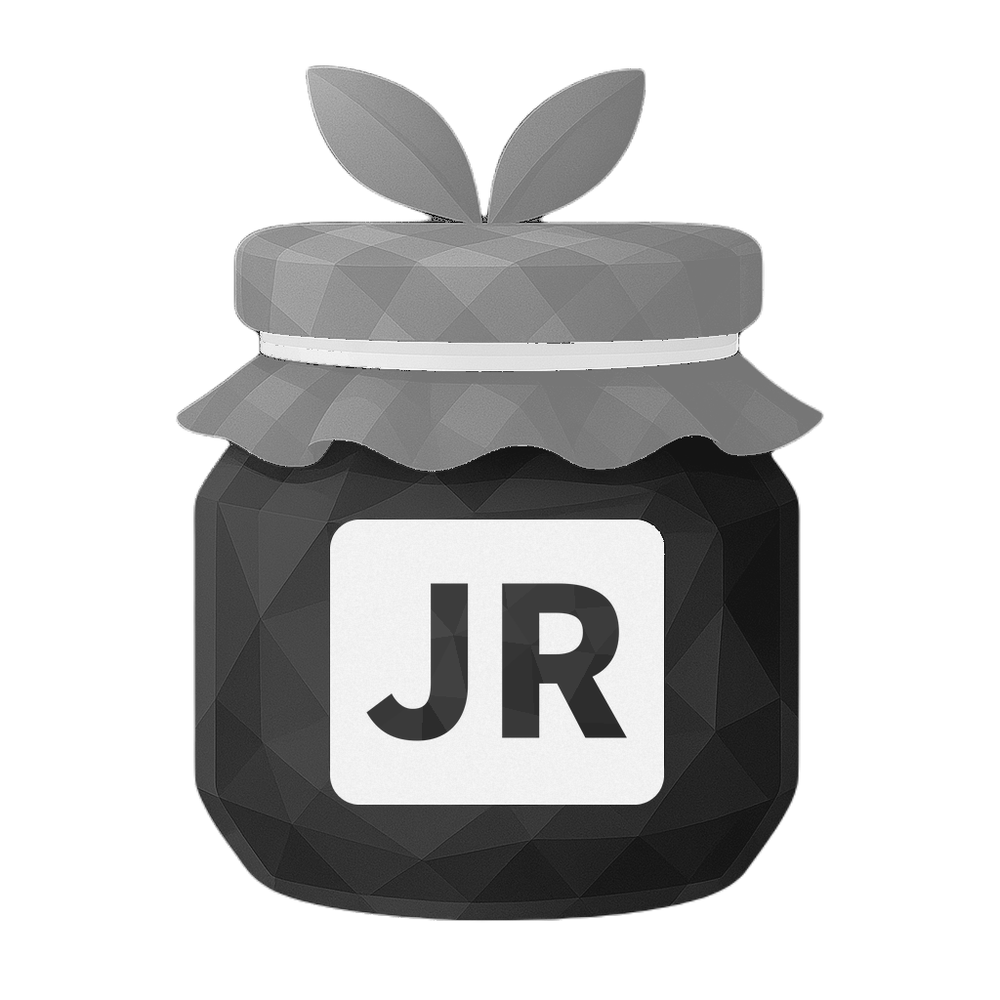

  

<h1 align="center">Jam Reborn</h1>

  A modular man-in-the-middle proxy for <a href="https://classic.animaljam.com/">Animal Jam Classic</a>. 
  <a href="https://discord.gg/UvXzA2gK5W">Join the Discord</a> · <a href="https://github.com/BradysLabs/Jam-Reborn/releases/latest">Download the latest release</a>

Jam Reborn sits between Animal Jam Classic and the game server, so plugins can read and act on the game's traffic. It's built with [Node.js](https://nodejs.org/) and [Electron](https://www.electronjs.org/).

**Unofficial community fork.** Jam Reborn is a community-maintained continuation of Jam. It is not affiliated with or endorsed by WildWorks or Animal Jam. See [Disclaimer](#disclaimer).

## What's new in 6.2.0

* **Plugin Hub.** A searchable page for every plugin, grouped into categories. Star the ones you use and they're pinned to the sidebar, so there's no more endless plugin list.
* **Streaming mode.** Hide your username on stream: in game (name tag, HUD, den name), on the login screen and in Jam. Only you see the display name you pick; everyone else still sees your real name.
* **Adventures.** A new plugin that plays adventures step by step, with a checklist, looping and automatic prize picking. Starts with Return of the Phantoms.
* **Name Checker.** Find usernames that are still free, using the game's own sign-up check. Search short names, dictionary words, themed words (animals, colors, fantasy and more), first names, patterns like `cat##`, repeats, or your own list. Progress is saved, so long searches can be paused and resumed.
* **Glow swaps.** Glow Picker has one-click color swaps: Red & Blue, Black & White, Christmas, Neon, Fire, Ice, Gold & Black, Halloween, Ocean, Candy and Rainbow.
* **Pairs.** Included with Jam Reborn now.
* **Safer plugins.** Plugins that don't come with Jam Reborn now need your approval before they run, and plugins are limited to 20 packets a second (adjustable) to help protect your account.
* **Better tools for plugin makers.** `jam.onPacket` for watching every packet, packets sent by plugins now show in Packet Inspector, errors from plugin windows show in Jam's console, optional log files, and a new [plugin guide](docs/plugins.md).
* **Fixes.** Jam now tracks the room you joined (not the one you left), the plugin reload button no longer breaks room tracking, closing the game no longer shows "Failed to start Jam Classic", a failed connection is no longer treated as connected, settings switches respond on the first click, Jam no longer crashes when another copy is already running (it says so in the console instead), closing a plugin window now removes all of its packet hooks so long sessions don't slow down, and your settings are now saved to `settings.local.json` (your existing settings carry over automatically), so they're never included if you commit or share the project.

## What's new in 6.1.0

* **Asset Browser.** Browse every clothing and den item with names, values and members-only status. Search by name, id or price range, view each item's raw game data, open any of the game's data files, and build content server addresses.
* **Masterpiece Studio.** Turn a picture into a masterpiece file with crop, zoom, fit and stretch, then submit it in-game the normal way. You can also open masterpiece files to get the picture back out.
* **Glow Picker.** Choose your glow from presets or any RGB color, and hold one color, cycle your favorites, or go random. Replaces the Glow command.
* **Packet Inspector, rebuilt.** Category filters, muting and pinning, a Packet Guide with 48 documented packets, side-by-side packet comparison, your own notes on any packet, and text or JSON export.
* **Item names everywhere.** Item names and prices load from the game's data files and refresh automatically when Animal Jam updates.
* **Fixes.** Includes the 6.0.1 fix for Play launching the normal Animal Jam client on new installs.

## Included plugins

| Plugin | Type | What it does |
|---|---|---|
| Asset Browser | Window | Browse every item, the game's data files and their addresses |
| Masterpiece Studio | Window | Turn a picture into a masterpiece file, or open one |
| Adventures | Window | Play adventures step by step, with looping and prize picking |
| Pairs | Window | Helper for the Pairs minigame |
| Name Checker | Window | Find usernames that are still free to create |
| Glow Picker | Window | Pick your glow color from presets or RGB, or run color swaps |
| Room Browser | Window | Search and warp to any public room |
| Packet Inspector | Window | Live packet viewer with filters, a packet guide and comparison |
| Packet Replay | Window | Save, explain, and send packets |
| Membership | Command | Shows the game as a member on your screen only |
| Achievements | Command | Gives your character most in-game achievements |
| Packet Spammer | Window | Send packets repeatedly |

## Writing plugins

See the [plugin guide](docs/plugins.md) for `plugin.json`, window vs background plugins, watching and sending packets, and the room and player info Jam tracks.

## Legal Notice

**No liability.** Jam Reborn is used entirely at your own risk. The authors and contributors are not responsible for any consequences of using it, including account suspensions or bans, lost items or data, or any other damage.

**No warranty.** Jam Reborn is provided "as is", without warranty of any kind, express or implied. There is no guarantee that it works, keeps working after Animal Jam updates, or will receive support, updates or fixes.

**Not affiliated.** Jam Reborn is an independent, community-maintained project. It is not affiliated with, endorsed by, or supported by WildWorks or Animal Jam. Animal Jam and all related game assets, names and trademarks belong to their respective owners.

**Acceptable use.** Do not use Jam Reborn to access accounts that aren't yours, test or collect login details, check accounts, harass other players, or get around Animal Jam's paid features. Jam Reborn is meant for learning how the game's network protocol works and for building plugins.

**License.** Jam Reborn is released under the [MIT License](LICENSE). You may use, copy, modify and share it, as long as the copyright and license notice are included. See the LICENSE file for the full terms.
